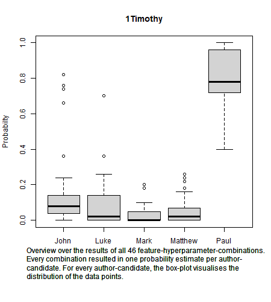
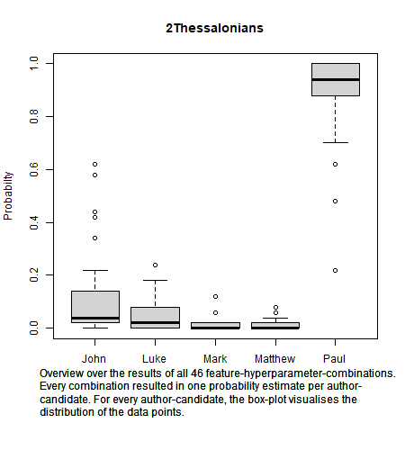
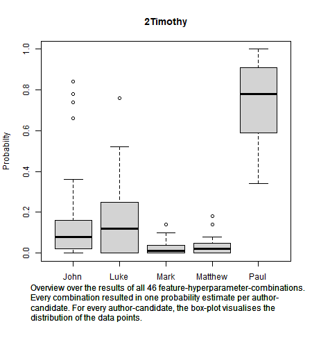
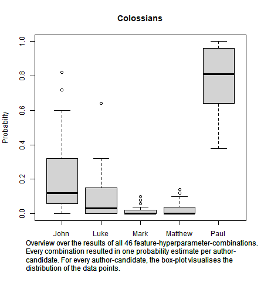
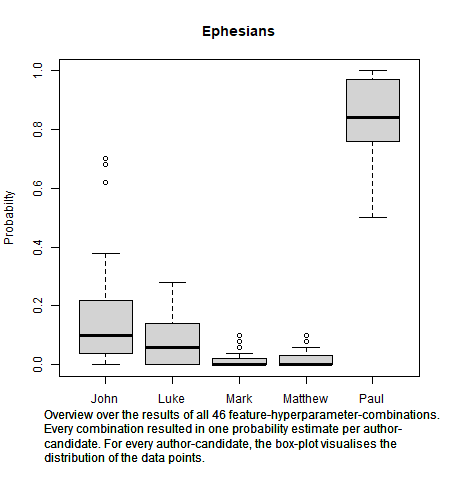
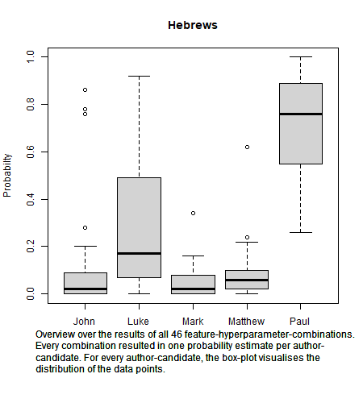
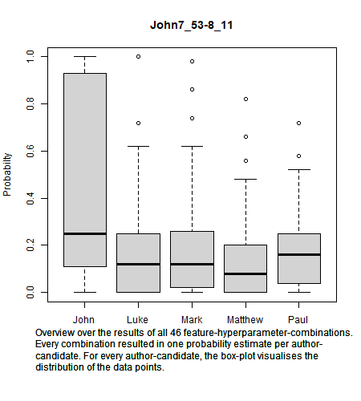
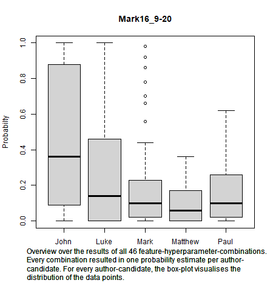
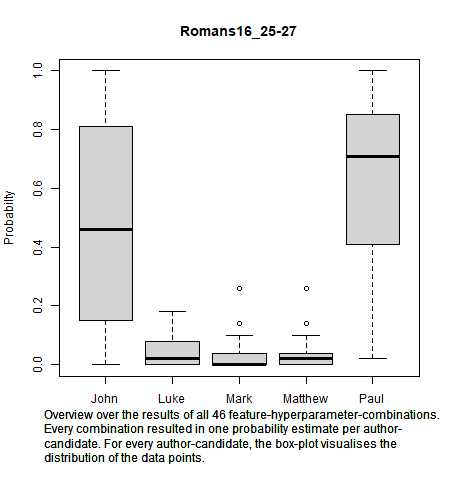
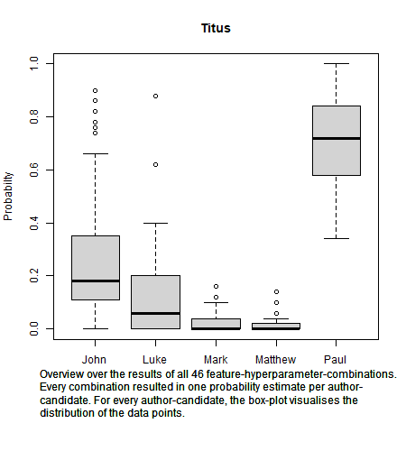

# Welcome to my New Testament Authorship Attribution project!

Which of the Pauline letters have really been written by the Apostle Paul? This Authorship Attribution study tackles this question by the aid of the General Imposters Framework as implemented in the R-package stylo. The assumptions are that Rom, 1-2 Cor, Gal, Phil, 1 Thess and Phlm are authentic, and that the non-Paulinian texts in the NT form a good corpus of distractor authors. This study uses as text representations {1,2,3}-grams of Greek words, {1,2,3}-grams of Greek letters, {1,2,3}-grams of Strong-numbers, and some variations of Part-of-Speech-tags with morphological information. These representations were combined with the distance measures Cosine, Entropy, and Canberra. These combinations were tested for attributive success, and only those with a very small area of uncertainty were selected to run the analysis, so that on theoretical grounds, the results are expected to be highly significant. The results of the imposters’ method show clear authorial signs of Paul for all seven contested Paulinian letters. Further research is needed to corroborate these results, but they could potentially gather interest in the field of theology. 

Curious? Take a look at the plots below!

The contents of this repository as well as the seminar paper are unpublished and have not been submitted to peer review yet. If you have feedback, feel free to open an issue or contact me (get my email here: https://unibas.academia.edu/JohannesNussbaum).

Overview:

- The seminar paper explains core concepts of authorship attribution and Machine Learning, and how the present study has been conducted. The current version is not fully developed yet, and has not been handed in yet.
- The excel sheet provides a step-by-step explanation of how to calculate distances between documents.
- 01_Data: The original files (see copyright notes below), and the slices/portions to analyse, subdivided into
  - Training_Data, and
  - Test_Data
- 02_Script: The R-Scripts needed to reproduce this analysis. Based on the General Impostor's framework as implemented in the R-package `stylo()` (https://cran.r-project.org/package=stylo)
  - 1 Preprocessing: Extract features (text properties, e.g. frequencies of words) from the text
  - 2 Hyperparameter and feature tuning: Create combinations of hyperparameters (e.g. distance measure) and features, and perform a grid search for the best combinations. Among the hundreds of combinations tested, 46 have been shown to be likely to yield statistically significant results.
  - 3 Analysis with the Imposters Method of `stylo()`
  - 4 Create boxplots in order to visualize the results
- 03_Output
  - Data: Intermediate steps of the data processing (RData, csv)
  - Plots: The actual results of this work, estimates of probability for the authorship of 10 passages of the New Testament

Reading help for 1Timothy: For every of the five candidates, there were 46 estimates of probability that this candidate wrote 1Timothy. This is due to the 46 combinations of features and hyperparameters. For Paul, the median of the estimates is a bit lower than 0.8. The grey box represents 50% of the data points, and the "whiskers" the entire range of the data points - with exception of outliers, which are separately displayed as small circles. 

## Copyright notes for the Greek text file
The Greek text file is available at http://getbible.net/scriptureinstall/Greek__NT_Westcott_Hort_UBS4_variants_Parsed__westcotthort__LTR.txt
or identically at https://github.com/getbible/Unbound-Biola/blob/master/Greek__NT_Westcott_Hort_UBS4_variants_Parsed__westcotthort__LTR.txt

Informations about Unbound Biola: 
https://unbound.biola.edu, © 2005-2006 Biola University, 13800 Biola Ave., La Mirada, CA 90639, United States of America.

Greek NT: Westcott/Hort, UBS4 variants [Parsed]
The Westcott-Hort edition of 1881 with complete parsing information for all Greek words. Readings of Nestle-Aland 27th/UBS4 shown, also with complete parsing information attached.

{VAR1: Refers to Westcott-Hort}

{VAR2: Refers to Nestle-Aland 27th/UBS4}